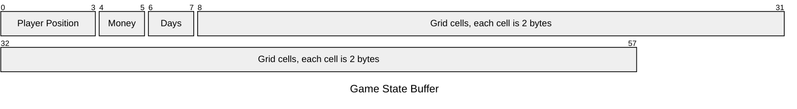

# CMPM-121-Phaser-Valley

## Table of Contents
- [Devlog F.1](#F.1)
- [Devlog F.0](#F.0)
- [Devlog Team](#Team)

## Devlog Entry F.1 - 12/6/2024 {#F.1}

### Requirements

- Character Moves on 2d Grid  
- - Same as last week  
- Time Advances Manually  
- - Same as last week  
- Proximity-Based Reaping and Sowing  
- - Same as last week  
- Grid Cells Have Sun And Water Levels  
- - Same as last week  
- Each Plant Has Both a Type and a Growth Level  
- - Same as last week  
- Plant Growth is Governed by Simple Spatial Rules  
- - Same as last week  
- Scenario is Completed When Some Condition is Satisfied  
- - Same as last week  
- Cell Information is Stored as an Array of Structs or a Struct of Arrays  
- -  Our grid cell information is stored as an array of structs using ArrayBuffers, following the format depicted below.  

- - Each cell is represented by a 2 byte integer from 0000 to 10532, organized as follows - the thousands digit represents the cell's water level (0-10), the hundreds digit represents the cell's light level (0-5), the tens digit represents the index of the plant in the cell (0-3), and the ones digit represents the growth stage of the plant (0-2).  A 0 in the tens place is interpreted as the absence of a plant.

- Infinite Undos and Redos  
- - Undos and Redos are implemented as a pair of stacks.  Sowing and reaping plants and advancing time add a snapshot of the game state to the undo stack in the form of an ArrayBuffer as depicted above.  Pressing the undo button moves the top of the undo stack to the redo stack and loads the game state from the new top of the undo stack.  Pressing the redo button moves the top of the redo stack to the undo stack, then loads from the new top of the undo stack as before.  Adding a new snapshot to the undo stack by any means other than the redo button clears the redo stack.  
- Multiple Save Files and Autosaving  
- - The game maintains three save files and one autosave in local storage.  The save files are manually saved to using the save button, while the autosave updates upon starting the game and whenever the time is advanced.  Upon starting the game, the player is able to select a save file to start from - if the save file has data it will be loaded, otherwise the default start will be loaded.  The player may also manually load a save file at any point prior to finishing the game.

### Reflection

There were no significant changes to our plans from last Devlog, save that our Tools Lead JC finally set up deno on the repository.  Hasn't exactly been a lot of time to end up changing plans otherwise - Typescript remains the most viable change option in terms of engines.

## Devlog Entry F.0 - 12/3/2024 {#F.0}

### Requirements

- Controlled Character Moves Across a 2d Grid

The game occurs on a 5*5 2D Grid. Arrays are used to store all values related to a given cell.
The player can move between cells using the arrow keys, which adjusts the character's coordinates by one in the relevant direction, 
then moves the character sprite by the length of one cell.

- Time Advances Manually

There is a button onscreen that advances time for all the cells, updating them based on rules explained below.  Time does not pass while the player is walking around.  

- Proximity-Based Reaping and Sowing

Player can select on the near by cell and sow a new plant or reap a fully grown plant. If no cell is select, it will sow a new plant or reap on the player cell. 

- Grid Cells Have Sun And Water Levels

Each cell has both a sun level and a water level, displayed as an integer value.  When the "Next Day" got click, for every cell, the sun levels will randomized between 0 and 5 every turn.  And each cell gains anywhere between 0 and 3 water level per turn, and loses 2 water level if it has both at least 1 sun and a plant of growth stage 0 (just planted) or 1 (partially grown).  

- Each Plant Has Both a Type and a Growth Level

There are three kinds of plants - mushrooms, grass, and pumpkins.  Each plant has three stages of growth, and a different value when reaped, which can only be done when the plant is fully grown.  

- Plant Growth is Governed by Simple Spatial Rules

When the player click "next day", if a cell has a plant that is not fully grown, and the cell has at least 1 sun and 2 water, then the plant's growth stage increases by 1 and the water level of the cell decreases by 2. And the growLevel of the plant will plus 1, the texture will also change.

- Scenario is Completed When Some Condition is Satisfied

The goadl for the game is earn money, player start from $10, player can sow different plant, wait for them grow, reap them for money. The winning conditions in the game is very simple now, when the money that the player have is $100 or more, the player will go the wining scene. And it will told the player is win the game in XX days. 

### Reflection

We determined that Tiled was not necessary to our project, so we have decided to cut it from the project.  In addition, Haorong has been promoted to Design Lead, as Erik has been MIA for the past few weeks.  

## Devlog Entry - 11/13/2024 {#Team}
### Introducing the Team

- Erik Lu / kami-lel: Design Lead

- Haorong Rong / hrong1: Design Backup Lead

- Ian Wallace / 14N-W4774c3: Engine Lead

- Jc Zaragoza / Jzara3115: Tools Lead

### Tools and Materials

We intend to use the Phaser3 framework, as we're all familiar with it and it provides some simple options for changing engines partway through the assignment.  

We will start out working in JavaScript. We all took CMPM 120, so this is nothing new. This allows us to focus on making the game within the remaining time in the course.  

We expect to be using Tiled for some graphical assets and Visual Studio for coding. Again, these are things we're all familiar with, so we can focus on swapping over and making the game instead of getting distracted learning new tools. We may also make use of some open source assets, to minimize the time spent on non-coding tasks.  

We will be swapping to Phaser3 / TypeScript. Some members of the group expressed a dislike of Javascript, so we decided to swap away from it rather than swapping to it.  

### Outlook

For the most part, we're looking to focus on learning how to handle transitioning from one engine to another, with minimal focus on the added difficulty of learning new tools, frameworks, or languages. We're not taking any particular additional risks or challenges - those are good ways to miss deadlines, and we're in the holiday season.
